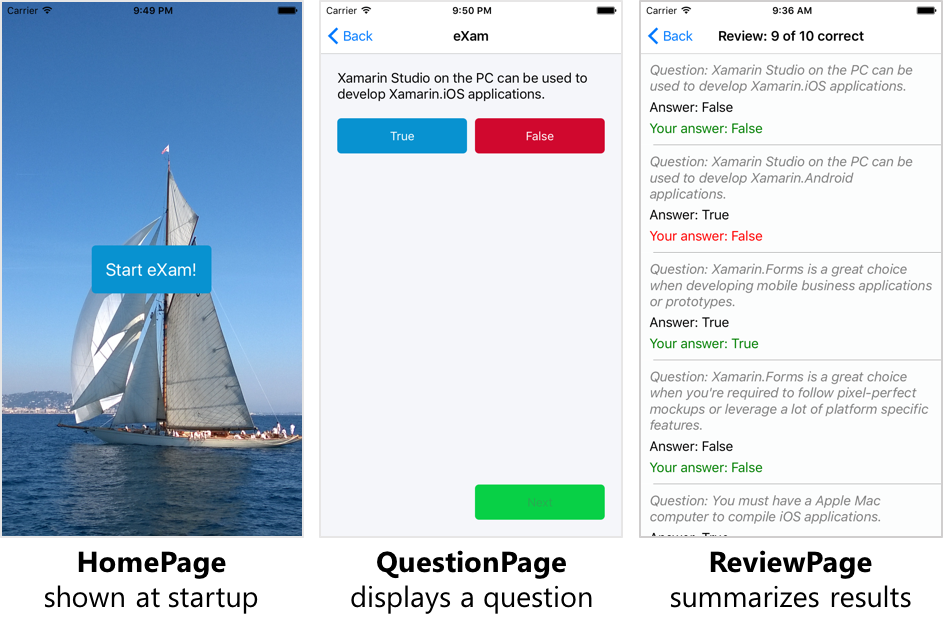
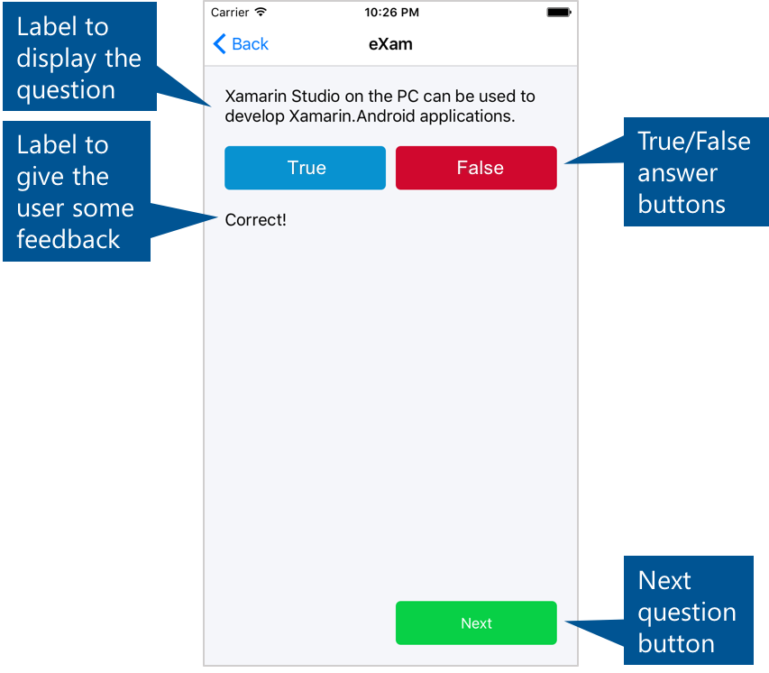
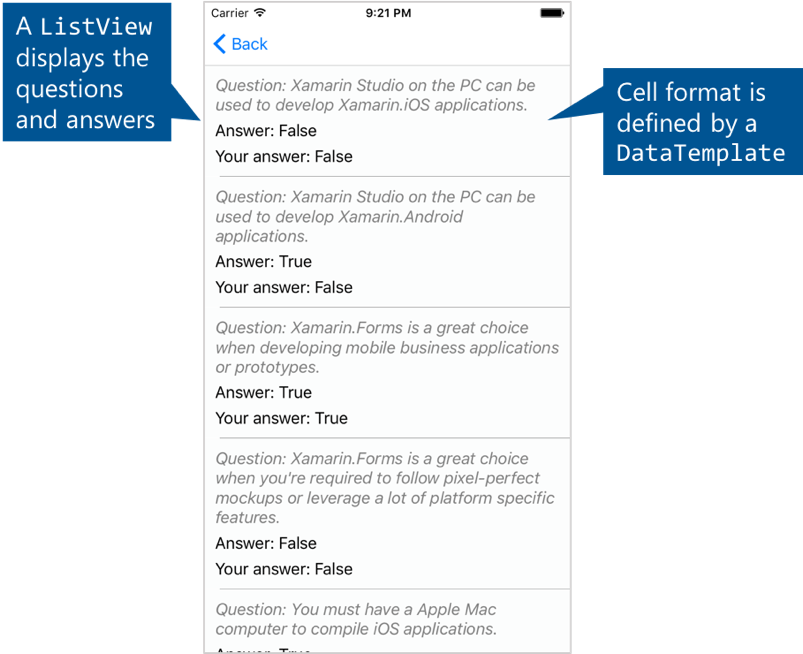
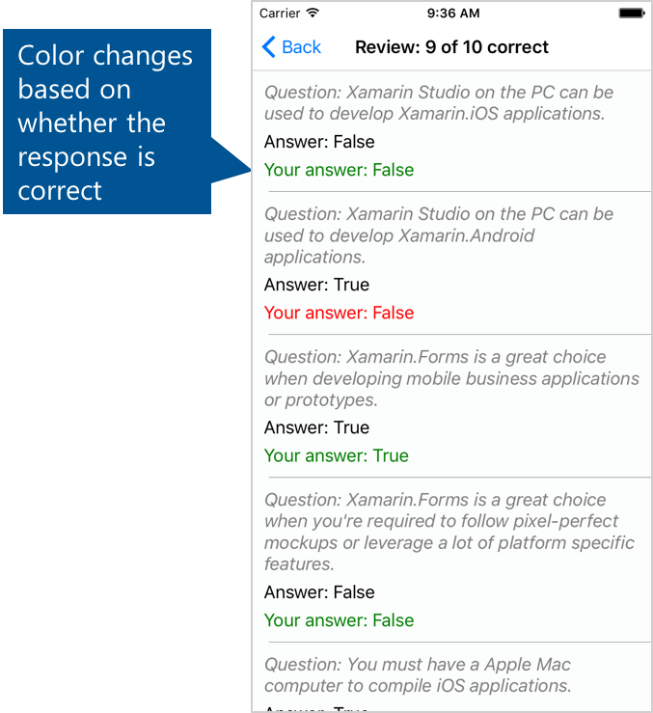

# Fundamentals Track Exercises

You are going to build a simple quiz application in Xamarin Forms. The app will load a set of true/false questions from either a local file or a web URI and display them one at a time for the user to answer. It will track the user’s answers and display their score at the end.

The app will have three pages:

> 

You will start from the beginning by creating a new project. You will code the parts of the app related to core Xamarin skills like UI creation and cross-platform techniques. Some of the platform-agnostic code, such as the game logic and model classes, will be supplied. This combination of your work and supplied code should allow you to practice key skills while creating a functional app in a short amount of time.

The supplied code and an image can be found in the **Assets** folder. Please make sure you have this folder before you begin.

## Create the Xamarin.Forms project
       
1. Open either Visual Studio or Xamarin Studio
2. Create a new Xamarin.Forms PCL project named **eXam**:

| Platform | What you need to do |
|----------|-----------------|
| Mac      | Cross-platform **>** App **>** Xamarin.Forms App C\# (select the "Use Portable Class Library" radio button on the 2nd screen)
| Windows  | Templates **>** Visual Studio C\# **>** Cross-Platform **>** Blank App (Xamarin.Forms portable). For the UWP project, accept the default versioning.

3. Update the Xamarin.Forms NuGet package in each project.
4. Run one or more of the platform-specific projects to verify your installation and setup are configured correctly. You can use either a simulator or a device.

## Add a landing page programmatically                                               

In this part, you will create the landing page and add a button centered in the page. This part is UI-only so the button will not have any behavior yet.

1. Add a new Forms **ContentPage** (without XAML) named **HomePage** to the **eXam** PCL project.

2. Open **HomePage.cs**.

3. Locate the page’s constructor, the next few steps will be done inside the constructor.

4. Delete the default code from the constructor.

5. Create an **AbsoluteLayout** and store it in a local variable.

6. Assign the layout to the **Content** of the page.

7. Create a **Button** and set its **Text** to &quot;Start eXam!&quot;. Optionally, set the **TextColor**, **BackgroundColor** and **Font** to values of your choice.

8. Add the button to the **Children** of the **AbsoluteLayout**. Optionally, pass positioning information to center the button on the page; use (0.5, 0.5, 150, 60) as the Rectangle parameter and **PositionProportional** for the **AbsoluteLayoutFlags**.

9. Open the Application class: **App.cs** in Xamarin Studio or **eXam.cs** in Visual Studio.

10. In the app’s constructor, delete the default code and assign a new instance of **HomePage** to the app’s **MainPage** property.

11. Run the application to test your work.

## Display an image on the landing page

In this part, you will add a background image to **HomePage** (see below).


1. Create an **Images** folder in the PCL project.

2. Locate **background.jpg** in the provided Assets folder and add it to your **Images** folder.

3. Set the build action for **background.jpg** to **EmbeddedResource**.

4. Open **HomePage.cs** and locate the constructor.

5. Create an **Image** object. Set its **Source** using the static **ImageSource.FromResource** method passing **eXam.Images.background.jpg** as the resource. Set its **Aspect** to **AspectFill.**

6. Add the image to the **Children** of the **AbsoluteLayout**. Use (0, 0, 1, 1) as the Rectangle parameter and use **SizeProportional** for the **AbsoluteLayoutFlags**. The order you add the children determines their z-order; you should add the image first so it appears below the button.

7. Run the application to test your work. You should see the Start button over the new background image.

## Set up stack navigation

In this part, you will add a **NavigationPage** that provides the infrastructure needed to switch between app pages. In a later part, you will use the **NavigationPage** to change pages in response to button taps.

1. Open the Application class: **App.cs** in Xamarin Studio or **eXam.cs** in Visual Studio.

2. In the constructor, instantiate a new `NavigationPage` passing an instance of **HomePage** into the constructor. Assign the **NavigationPage** to the app’s **MainPage**. This will replace the previous assignment of a **HomePage** object.

3. Run the application; notice you now have a navigation bar showing on the landing page. You’ll use the navigation bar on other pages but you don’t need it on the landing page.

4. Open **HomePage.cs** and locate the constructor.

5. Hide the navigation bar using the static `NavigationPage.SetHasNavigationBar` method.

## Turn on XAMLC

In this part, you will instruct the build system to compile your XAML pages. This gives you more compile-time validation and improves runtime performance.

1. Open the Application class: **App.cs** in Xamarin Studio or **eXam.cs** in Visual Studio.

2. Add the `XamlCompilationAttribute` to the top of the file to enable assembly-wide XAML compilation.

3. Run the application to make sure it still runs as expected.

## Add a XAML page

In this part, you will add a page to display a quiz question (see below). This part is UI-only so the buttons will not have any behavior yet and the labels will display place-holder text.



1. Add a new XAML page to the PCL project. The template is called **Forms Content Page Xaml** in Xamarin Studio; it’s called **Forms Xaml Page** in Visual Studio. Name it **QuestionPage**.

2. Open **QuestionPage.xaml**.

3. Add a `Grid` with 4 rows and 2 columns to the **Content** of the **Page**.

	- The height of rows 0, 1, and 3 should be **Auto** sized to match their largest child.
	- The height of row 2 should be set to &quot;*&quot; so it takes up all the remaining vertical space.
	- The columns should be equal width, which is the default.

To get you started, below is sample showing how to define the first row in XAML, the other rows and the columns are similar:

```
<Grid.RowDefinitions>
<RowDefinition Height="Auto" />
...
</Grid.RowDefinitions>
```

4. Add 3 buttons and 2 labels to the Grid as shown in the screenshot above.

5. Provide default **Text** for the labels so you can see them during testing.

6. Set the Page’s **Title** property to "eXam". This can be done in either the .xaml or .xaml.cs file.

## Navigate on button tap

In this part, you will add behavior to the landing-page button so it navigates to the question page.

1. Open **HomePage.cs**.

2. Locate the code in the constructor where you create the button.

3. Subscribe to the button’s **Clicked** event using any subscription technique you prefer (named method, lambda, delegate).

4. In your handler, navigate the app to **QuestionPage**. Use the page’s inherited **Navigation** property and its **PushAsync** method to move the app to the new page.

5. Run the application and tap the Start button.

This is the first time you will be able to see the **QuestionPage** UI running live. Spend a few minutes revising the UI layout if needed.

## Load game data

In this part, you will add pre-written classes for the game logic and an XML file containing the questions. You’ll hold a static instance of the game class in the Application class so it’s easy to access from all parts of the app.

1. Locate **QuizQuestion.cs**, **QuizQuestionXmlSerializer.cs**, and **Game.cs** in the provided Assets folder and add them to the PCL project.

2. Open **QuizQuestion.cs**. This is the model object for a question. It is provided to save you some typing.

3. Open **QuizQuestionXmlSerializer.cs**. This provides methods to translate **QuizQuestion** objects to/from XML. Again, this is fairly straightforward C\#/.NET code and is provided to save you time.

4. Open **Game.cs**. This implements the game logic to track user progress, remember user answers, and calculate their score. Notice how this too is pure C\#/.NET – it is platform-independent code that can be shared across all the platforms you want to support: iOS, Android, Windows, MacOS, etc.

5. Add a new folder named **Data** to the PCL project.

6. Locate **questions.xml** in the Assets folder. Add it to the **Data** folder.

7. Set the **Build Action** of **questions.xml** to **Embedded Resource**.

8. Open the Application class: **App.cs** in Xamarin Studio or **eXam.cs** in Visual Studio.

9. Locate **OnStart**. You will be adding code to this method.

10. Files packaged as Embedded Resource are available through the Assembly object for that assembly. Use `typeof(App).GetTypeInfo().Assembly` to get a reference to the assembly object containing the App class and store it in a local variable.

11. Use the **GetManifestResourceStream** method from the **Assembly** class to open the questions.xml file. The filename needs to include the assembly name and the folder name: **eXam.Data.questions.xml**.

12. You now have a `Stream` object. Use a `StreamReader` and its `ReadToEnd` method to convert the file contents into a string.

13. Use the provided `QuizQuestionXmlSerializer` to deserialize the stream containing the XML into a `List<QuizQuestion>`.

14. Instantiate a **Game** object passing in the list of quiz questions; store the game object in a `public static` property named **CurrentGame** in the App class.

## Cache game data

In this part, you will add code to cache and load the quiz questions from the on-device file system. This is preparation for a later step when you will download the questions from a web URI – the idea is to always have a cached copy of the latest questions on-device so the user can still play the game even if the app does not have Internet connectivity.
 
Working with the on-device file system requires specific code for each platform. You will do this with an interface in the PCL that is implemented by a separate class in each of the platform-specific projects.

1. Add a new interface named **IFileHelper.cs** to the PCL.

2. Add the code below to the **IFileHelper.cs** file. This interface is intentionally kept simple; for example, notice how **LoadLocalFileAsync** and **SaveLocalFileAsync** transfer the file contents as a single string. If you can think of a more sophisticated design; for example, you could use **Stream**s instead of strings, please feel free to experiment as you have time.

```
public interface IFileHelper
{
  Task<string> LoadLocalFileAsync (string filename);
  Task<bool>   SaveLocalFileAsync (string filename, string data);

  string GetNameWithPath (string filename);
}
```

3. In the assets folder, you will find **PlatformFileHelper.cs** containing an implementation of the interface for each platform. Add the appropriate file to each platform-specific project. Use the file in the Windows folder for all three Windows platforms.

4. Use an assembly-level attribute to register **PlatformFileHelper** with the **DependencyService** in each platform-specific project. For simplicity, this can be done in each **PlatformFileHelper.cs** file.

5. Open the Application class: **App.cs** in Xamarin Studio or **eXam.cs** in Visual Studio.

6. Locate **OnStart**. You will be adding code to this method.

7. Use the **DependencyService** to get an `IFileHelper` implementation. The **DependencyService** will give you the correct implementation based on the current runtime platform.

8. Use the **FileHelper** to load a file named **cachedquestions.xml** using the **LoadLocalFileAsync** method (the xml file doesn’t exist yet but we’ll create it shortly). Notice this method returns a `Task<string>` so you’ll need to add the **async** keyword to the **OnStart** method and await this call.

9. Test if the load fails by checking if the returned string is **null**. If it failed, you don’t have a cached copy on disk yet, so run the existing code that loads the XML from the embedded file in the PCL. Notice how we are setting up a fallback: use the cache if it is available, otherwise use the embedded file. Later, we will extend this concept to include a question file downloaded from a web URI.

10. After loading from the PCL, use the `FileHelper` to save the XML in a file named **cachedquestions.xml**. The next time the app runs, this cached version will be available and the app won’t need to load from the embedded file.

11. At this point, you will have a string that represents the XML. Your existing code that converts the string to a `List<QuizQuestion>` and then uses the `List<QuizQuestion>` to instantiate a **Game** object will remain the same.


## Add code to detect the current network state
 
In this part, you will check if the app is connected to the internet. You will use a NuGet package that lets you write cross-platform code in your PCL to avoid writing platform-specific implementations.

1. Add the NuGet package &quot;Connectivity Plugin for Xamarin and Windows&quot; (Id **Xam.Plugin.Connectivity**). You will need to add it to all projects: the PCL and each platform-specific project.

2. Open the Application class: **App.cs** in Xamarin Studio or **eXam.cs** in Visual Studio.

3. In **OnStart**, use the static **CrossConnectivity.Current.IsConnected** property to check if the application is connected to the internet. Output the results using **Debug.WriteLine**. The call to **WriteLine** is just for testing; later, we will remove it and use the connectivity check to determine whether we can download the questions from a web URI.

4. Run the application and check the output. If you’re using an Android simulator, you can disable the network in the Settings to test the no-connectivity case.

## Add support for Json.NET

In this part, you will update the app to load the quiz questions from a JSON file instead of XML. This is in preparation for the next step where you will download the JSON file from the web instead of loading it locally.

1. Locate **questions.json** in the Assets folder. Add it to the **Data** folder in the PCL project.

2. Set the **Build Action** of **questions.json** to **Embedded Resource**.

3. Add the Newtonsoft **Json.NET** NuGet package to all your projects (the PCL and each of the platform-specific projects).

4. Open the Application class: **App.cs** in Xamarin Studio or **eXam.cs** in Visual Studio.

5. Locate **OnStart**, your will be modifying the code in this method.

6. Change the name of the loaded question file from **questions.xml** to **questions.json**.

7. Change the name of the cache file from **cachedquestions.xml** to **cachedquestions.json**.

8. Change the deserialize code so it uses `JsonConvert.DeserializeObject<List<QuizQuestion>>()` from the Json.NET package instead of `QuizQuestionXmlSerializer.Deserialize`.

## Download and update quiz questions

In this part, we will change the app so it uses a JSON question file downloaded from the web. The app will download the JSON file at startup whenever it has connectivity. We will continue to use our code that makes a local cached copy of the JSON so that the app will still work even when it does not have internet access.

1. Add the **Microsoft HTTP Client Libraries** NuGet package (Id **Microsoft.Net.Http**) to the PCL. This will allow you to use **HttpClient** from within a PCL.

2. Open the Application class: **App.cs** in Xamarin Studio or **eXam.cs** in Visual Studio.

3. A JSON question file is available online for you to use. Add the following property to the **App** class to specify its location.

```
static Uri JsonQuestionsUri
{
	get 
	{
		return new Uri("https://www.dropbox.com/s/racrgjrsq2xcwdu/questions.json?raw=1");
	}
}
```

4. In **OnStart**, Remove the **Debug.WriteLine** that displays connectivity status.

5. You will still need the test for connectivity. Now though, if you have connectivity use **HttpClient**’s **GetStringAsync** method to download the JSON file at the URI above. You will need to **await** this call.

6. If you do not have connectivity, execute the previous code that loads the questions locally. In either case, you should still cache the JSON string in a local file.

7. Run the application and debug your code to ensure you’re downloading the updated questions.

## Use data binding to display a question

In this part, you will use data binding to display a question on the question page.

1. Open **QuestionPage.xaml.cs**.

2. Add a constructor that accepts a **QuizQuestion** and assign the **QuizQuestion** to the **BindingContext** of the page. You will also need to call **InitializeComponent** from your new constructor.

3. Open **HomePage.cs**.

4. Locate the click handler for the start button.

5. During the navigation, pass in the **App.CurrentGame.CurrentQuestion** property to the **QuestionPage**’s constructor.

6. Open **QuestionPage.xaml**.

7. Locate the **Label** that displays the question text.

8. Bind the label’s **Text** property to the Binding Context’s **Question** property.

9. Run the application and navigate to the question page. You should see question text for the first question.

> Optional: If you try to launch the Question Page before the questions have finished loading you’ll get a null reference exception. Add a public property to **HomePage.cs** to control the **IsEnabled** property of the start button. Set the property from the app’s **OnStart** method: false when you begin the method and true once you have finished loading the questions. This requires several changes to your code, only complete this step if you have extra time.

## Create and connect view models to drive the UI

In this part, you will create a view model to make it easier to control visual properties of the question page.

1. Create a new class named **QuestionPageViewModel** in the PCL project and open the file.

2. Add or update the constructor signature to accept a **Game** object. Save the Game object in a field named **game**.

3. In the constructor, call **Game**’s **Restart** method. This ensures that navigating to the question page will always start a new game.

4. Recall that the question page needs to display the text of the question and a correct/incorrect indicator once the user answers the question. Create two string properties in the view model that you will use for binding; name them **Question** and **Response**.

	- For the **Question** property, add a getter that returns **game.CurrentQuestion.Question**.
	- The **Response** property requires a bit more code. First, do some error checking: test if **game.CurrentResponse** is null and, if so, return an empty string. Otherwise, you know the user has responded to the question and you can move on to checking if they responded correctly: compare **game.CurrentQuestion.Answer** and **game.CurrentResponse** to see if they responded correctly. Based on the comparison, return a string of your choice to indicate to the user whether they were correct or incorrect.

5. Open **QuestionPage.xaml.cs**.

6. Change the constructor signature that currently accepts a **QuizQuestion** to accept a **QuestionPageViewModel** instead. Assign the view model to the **BindingContext** of the page.

7. Open **QuestionPage.xaml**.

8. Find the label that gives the user the &quot;Correct&quot; / &quot;Incorrect&quot; feedback on their response. Bind the label’s **Text** property to the **Response** property of the view model.

9. Open **HomePage.cs**.

10. Locate the click-event handler for the start button.

11. Change the instantiation of **QuestionPage**: create an instance of **QuestionPageViewModel** and pass it to the **QuestionPage** constructor.

12. Run the application and verify the question text is still displayed on the question page. The &quot;Correct&quot; / &quot;Incorrect&quot; response feedback will not be displayed yet.

## Implement INotifyPropertyChanged

In this part, you will prepare your **QuestionPageViewModel** to update the UI when the user taps the True/False/Next buttons on the **QuestionPage**.

1. Open **QuestionPageViewModel.cs** in the PCL project.

2. Implement **INotifyPropertyChanged** on the **QuestionPageViewModel** class: add the interface to the class declaration and add the public **PropertyChanged** event.

3. You need to update several visible properties on multiple views. In a case like this, it is reasonable to signal that all properties were updated instead of signaling the affected properties individually. Create a new **void** method named **RaiseAllPropertiesChanged**.

4. In **RaiseAllPropertiesChanged**, you will raise the **PropertyChanged** **event**. First, ensure **PropertyChanged** is not null, and then raise the event. You’ll need to instantiate a **PropertyChangedEventArgs** object, passing an empty string into its constructor (it is the empty string that indicates to the bindings that _all properties have changed_ and will cause all bindings against the view model to refresh their UI). You will call **RaiseAllPropertiesChanged** in the next exercise.

## Use Commands to respond to button taps

In this part, you will use Commands to respond to button taps from the Question Page. Commands help you decouple the UI from the code-behind and are a core technique in data binding and the MVVM pattern. The page has three buttons (True, False, and Next) and you will use Command objects to respond to taps on each of them.

1. Open **QuestionPageViewModel.cs** in the PCL project.

2. Add three properties of type **Command**, one for each button. Name them **TrueSelected**, **FalseSelected**, and **NextSelected**. You can use the C\# &quot;automatic property&quot; syntax; you do not need to declare a backing field or implement get/set manually.

3. Create methods that implement the logic required when the user taps the True or False button: **void** **OnTrue()** and **void** **OnFalse()**:

	- In the **OnTrue** method, call **game.OnTrue** and then invoke **RaiseAllPropertiesChanged**.
	- In the **OnFalse** method, call **game.OnFalse** and then invoke **RaiseAllPropertiesChanged**.
	- When the user selects their response, the Next button needs to become enabled. In both **OnTrue** and **OnFalse** call **NextSelected.ChangeCanExecute**. This tells the **NextSelected** Command to raise an event that notifies the Next button that its enabled state must be updated.

4. Locate the **QuestionPageViewModel** constructor.

5. In the constructor, instantiate a **Command** object passing in **OnTrue** to its constructor. Assign the **Command** object to your **TrueSelected** property.

6. Add the analogous code for **FalseSelected**: instantiate a **Command** object passing in **OnFalse** and assign it to **FalseSelected** property.

7. Create an **async void** method for the Next button named **OnNext**. Call **game.NextQuestion** and check the Boolean result. If it’s **true** call **NextSelected.ChangeCanExecute** and **RaiseAllPropertiesChanged**.

8. The Next button should only be enabled after the user has responded to the question. Add a method named **OnCanExecuteNext** that returns a **bool** which indicates this: return false if the current response in the game class is null, otherwise return true.

9. In the **QuestionPageViewModel** constructor, instantiate a **Command** object passing in **OnNext** and **OnCanExecuteNext**. Assign the **Command** object to your **NextSelected** property.

10. Open **QuestionPage.xaml**.

11. For each button, bind the button’s **Command** property to the appropriate command in the view model.

12. Run the application and answer several questions. Notice the Next button is disabled until an answer is chosen.

> Optional: Prevent the user from changing their response (for True/False question, it doesn’t make sense to let the user answer a question more than once). To do this, add a Boolean property to the view model to control the True and False buttons’ enabled properties. When the game’s current response is null, enable the True and False buttons. When the current response is not null, disable the True and False buttons.

## Add a Page with a ListView 

In this part, you will code a new Content Page with a ListView to display the results of the quiz. You will also add a Navigation class and two view models to complete your MVVM implementation. The UI for the new page should look similar to the screenshot below when you are done.



1. You will need a view model for the Quiz Question class. You have two options: add the provided code to the project or write it yourself.

To add the provided code:
- Locate **QuizQuestionViewModel.cs** in the Assets folder and add it to the PCL. 

- Take a moment to review the code. It is a simple class but it demonstrates a few interesting patterns common to view models; for example, it provides a convenient **IsCorrect** property that is needed by the UI but isn’t available directly in the underlying quiz-question data.

To write it yourself:
- Add a new class named **QuizQuestionViewModel** in the PCL project.

- The view model will encapsulate a **QuizQuestion** instance as well as the user’s response. Change the constructor signature to accept this data: a **QuizQuestion** and a Nullable bool (i.e. **bool?**).

- Create a private field to store the passed-in **QuizQuestion** and a public property to hold the response. Assign both in the constructor.

- Create read-only properties to expose the three public properties of **QuizQuestion** (Question, Answer, Explanation). Your properties in **QuizQuestionViewModel** can use the same names as the underlying **QuizQuestion** properties (Question, Answer, Explanation).

- Create a read-only Boolean property named **IsCorrect** that determines whether the user’s response is the correct answer for that question.

1. Add a new class named **ReviewPageViewModel** to the PCL project and open the file.

2. Add a public `List<QuizQuestionViewModel>` property named **QuestionViewModels**. This property will hold the data that the list view will display.

3. Add/Change the constructor signature to accept a **Game** object named **game**.

4. Instantiate a `List<QuizQuestionViewModel>` and assign it to your property.

5. Create a `for` loop that runs from 0 to **game.NumberOfQuestions**. In each iteration, create a new **QuizQuestionViewModel** for one of the game’s questions and add it to the **QuestionViewModels** property. Use the **Questions** and **Responses** properties of **game** to get the question and response needed to create the view model object.

6. Add a new XAML Content Page to the PCL project. Name it **ReviewPage**.

7. Open **ReviewPage.xaml.cs**.

8. Change the constructor signature to accept a **ReviewPageViewModel**.

9. Set the **BindingContext** of the page to the **ReviewPageViewModel**.

10. Open **ReviewPage.xaml** and remove any default UI.

11. Add a **ListView** to the XAML page’s Content.

12. Use the **x:Name** directive to set the ListView’s name to **listQuestions** and set **HasUnevenRows** to **true**.

13. Bind the **ItemSource** to **QuestionViewModels;** we added this property the view model earlier.

14. Use the property-element syntax to assign the **ItemTemplate** property. Inside, create a **DataTemplate**.

15. Finally, nest a custom cell inside the **DataTemplate** by creating a **ViewCell**.

16. Inside the view cell, use a **StackLayout** to display three **Label**s. Bind each **Label**’s **Text** property to a property on a **QuizQuestionViewModel**: Question, Answer, and Response.

> Optionally, use **StringFormat** within the **Text** bindings to clarify the displayed text. For example **Text=&quot;{Binding Response, StringFormat=’Your answer: {0}’}&quot;**.**\
  **

17. Locate **NavigationService.cs** in the provided Assets folder and add it to the PCL. Take a moment to review the file. This will make it easy to navigate the app from code inside a view model without coupling the view model to the UI framework.

18. Open the Application class: **App.cs** in Xamarin Studio or **eXam.cs** in Visual Studio.

19. Register the navigation service in the constructor using the **DependencyService**’s static **Register** method. The method doesn’t take any regular arguments, but it does require you to pass the type you are registering as the generics parameter.

20. Open **QuestionPageViewModel.cs**.

21. In the **OnNext** method, if **game.NextQuestion** returns false, use the navigation service’s **GoToPageAsync** method to navigate to the review page by passing **AppPage.ReviewPage**. As this is a Task-based **async** method, you should **await** the call and add the **async** keyword to the **OnNext** method.

22. In **HomePage.cs**, update the start button’s **Clicked** event handler to use the navigation service.

## Display question explanation 

In this part, you will respond to user taps on the Review Page’s ListView to display an explanation of each question.

1. Open **ReviewPage.xaml.cs** in the PCL project.

2. Subscribe to the list view’s **ItemTapped** event using any subscription technique you prefer (named method, lambda, delegate).

3. The **ItemTappedEventArgs** has a property named **Item** that is a reference to the object that is bound to the tapped cell. In our case, it’s a **QuizQuestionViewModel**. Cast **e.Item** to a **QuizQuestionViewModel** and save it to a local variable named **qqvm**.

4. Display an Alert Dialog using the Page’s inherited **DisplayAlert** method. When displaying the alert, show the **Explanation** property of **qqvm**.

5. Run the application and tap on a cell in the Result Page’s list view.

## Polish the results page using a DataTrigger

In this part, you will use a DataTrigger to change the text color of the user’s response depending on whether the response is correct (see below).



1. Open **ReviewPage.xaml** in the PCL project.

2. Find the **Label** used to display the user’s response and change the syntax to use a full `</Label\>` closing tag.

3. Set the **Label**’s **TextColor** to **Red**.

4. Use property-element syntax to assign the **Triggers** property of the **Label**.

5. Within the **Triggers** tag, add a **DataTrigger**. Use data binding to bind the **DataTrigger**’s **Binding** property to the **IsCorrect** property of the view model. Set the **DataTrigger**’s **Value** property to **True**.

6. Make sure the **DataTrigger** has a full closing tag.

7. Inside the **DataTrigger** tags, add a **Setter** to update the label’s **TextColor** (Property) to **Green** (Value).

8. Run the application and complete the quiz to display the Review Page.

## Turn on cell recycling

In this part, you will enable cell recycling for the table view to reduce memory usage and improve performance.

1. Open **ReviewPage.xaml** in the PCL project.

2. Set the list view’s **CachingStrategy** to **RecycleElement.**

3. Run the application. With this amount of data, you’re unlikely to notice a performance difference, but the list view is now *reusing* the data template definitions and visual cells as you scroll rather than recreating them each time. For larger lists of data this can significantly improve performance.

## Add effects

In this part, you will add Effects to each platform that can be used to apply a gradient to controls. You will also create a RoutingEffect in the PCL and use it to apply the effect in the QuestionPage XAML.

1. Locate the **GradientEffectXXX.cs** files in the provided Assets folder and add them to the corresponding platform specific projects. The Assets folder contains individual files for Android and iOS. For Windows, there is one file that will be used for all Windows variants; however, you will need to add the appropriate using statement for each.

2. Examine the code. Notice that each one derives from **PlatformEffect** and implements the two required methods: **OnAttached** and **OnDetached**. Optionally, examine the platform specific code to draw a gradient.

3. Make note of the **GroupName** and **Effect** name specified in the assembly attributes above each class. They are the same on every platform.

4. Create a new class in the PCL named **GradientEffect**. Open the new file.

5. Update the class signature of **GradientEffect** to derive from **RoutingEffect**.

6. Add/Update the constructor to call RoutingEffect’s base constructor, passing in a string comprised of the **GroupName** and **Effect** name separated by a period.

7. Open **QuestionPage.xaml**.

8. Define an xmlns for the eXam namespace and assembly. Name it **effect**.

9. Using the **effect** xmlns, add a **GradientEffect** to the Effects collection of each button.

10. Run the application on any platform, you should see a gradient on each button of the QuestionPage.

> There’s another Effect class in the Assets folder named DisabledOpacityEffectIOS. This effect improves the readability of a button’s text when it’s disabled, this effect is provided for iOS only. Repeat the steps above to add this Effect to the **Next** button of the Question Page.

## Optional Ideas

**Congratulations**! You have built a full Xamarin.Forms application
that pulls data from a web endpoint, stores it locally in the app, and
guides the user through a set of screens to answer questions!

Here are some ideas to continue extending the application while you are
here at Evolve. Feel free to expand on this list and ask questions as
you continue your learning!

-   Every Xamarin.Forms page has a built in **Title** property that you
    can set. When displayed within a **NavigationPage**, the title will
    be shown on the **NavigationBar**. Set the **Title** for the Review
    page so that it shows the number of correct answers.

-   Set a custom background color on the Question page or the review
    page – what else needs to be considered? Try running it on multiple
    platforms.

-   Disable the Start **Button** at application start-up until the game
    engine is instantiated.

-   Add icons to each head project to display a customized icon in the
    launch screen for each mobile platform.

-   Xamarin.Form Navigation page has a built in Back button; its default
    text is &quot;Back&quot;. Each page can specify what text is displayed when it
    is the target of the back operation. For the HomePage, set the text
    of the Back button from its default of &quot;Back&quot; to something more
    meaningful such as &quot;End Game&quot; using
    NavigationPage.SetBackButtonTitle.


